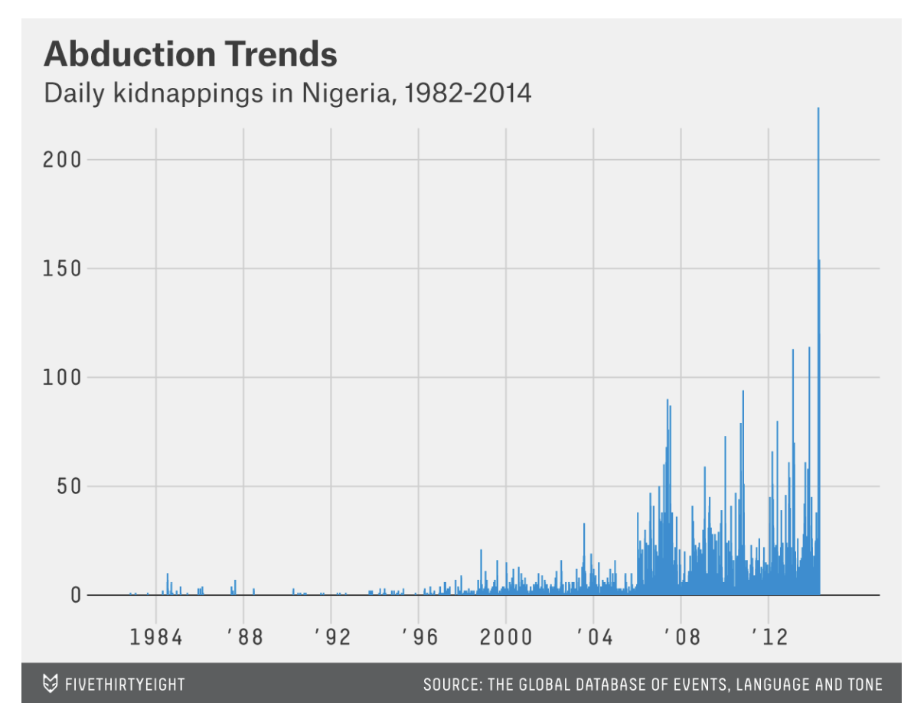

# Kidnapping in Nigeria
## Qianyun Zhang
_2024-04-02_
## Data Viz Summary.

I didn't use the Markdown syntax to show my data visualization, for my origin image is too big. So I use the HTML syntax to make it. :monocle_face:

### Summary for the data:
This image presents a trend line graph titled "**Abduction Trends: Daily kidnappings in Nigeria**, _1982-2014_," sourced from the Global Database of Events, Language, and Tone. It visually represents the number of daily kidnappings in Nigeria :nigeria: over a 13-year span, with marked increases in certain years. The graph's y-axis ranges from 0 to 200 daily kidnappings, and the x-axis denotes the years from 1982 to 2014. Importantly, a notable peak is observed in 2014, specifically highlighting a surge in kidnappings during that period. The image communicates a concerning escalation in abductions, particularly in the year 2014, as indicated by the sharp rise on the graph.
> Several weeks after this initial reporting, the popular blog _FiveThirtyEight_ published its own data-driven story about the event, titled “Kidnapping of Girls in Nigeria Is Part of a Worsening Problem.” The story reported skyrocketing rates of kidnappings. It asserted that in 2013 alone there had been more than 3,608 kidnappings of young women. Charts and maps accompanied the story to visually make the case that abduction was at an all-time high.

## Data Viz Biography.
  - **Who or what institution produced the visualization? (Hint: refer to ["Figure Credits"](https://data-feminism.mitpress.mit.edu/pub/ftb0980j/release/1?readingCollection=0cd867ef))**   
   **_Mona Chalabi_** from he popular blog _FiveThirtyEight_    
   :point_right: [The original blog](https://fivethirtyeight.com/features/nigeria-kidnapping/)
  - **When was it produced?**   
   MAY 6, 2014, AT 5:15 PM
  - **Who is the audience for the visualization?**   
   The readers on the blog FiveThirtyEight.
  - **How might the visualization be interpreted or misinterpreted? What consequences might this interpretation/misinterpretation have?** :thinking:   
   The visualization can be interpreted as a reflection of the current state of kidnappings in Nigeria, with a focus on the 2014 peak. However,it is important to note that kidnappings in Nigeria are a complex issue, and the data may not be comprehensive or representative of the full picture. Meanwhile,the database that the blog _FiveThirtyEight_ use is controversial. It may exaggerate the severity of the problem, or fail to capture important factors such as gender disparity or the role of parents in the situation.
  - **How, if at all, does the data visualization represent power or systems?**   
   The data visualization does not exolicitly represent power or systems.But the use of the data may be seen as a form of power, as the database _GDELT_ did not clarify :astonished: whether it count the reports or a single event about kidnapping in Nigeria :nigeria:.